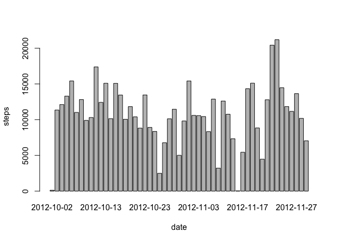
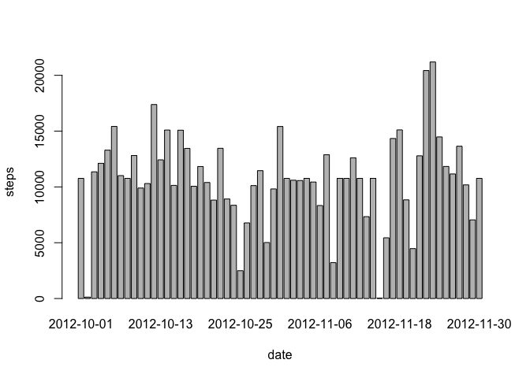
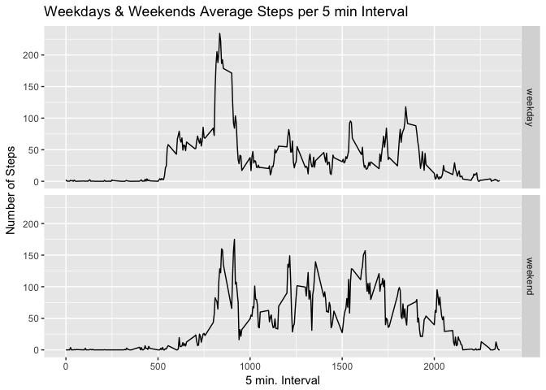

# Reproducible Research: Peer Assessment 1


## Loading and preprocessing the data

```r
        # Needed packages
        library("knitr")
        library("ggplot2")
```

```
## Warning: package 'ggplot2' was built under R version 3.3.2
```

```r
        # Open File, if needed download and unzip it
        file <- "activity.csv"
        if (!file.exists(file)) {
                file <- "activity.zip"
                if (!file.exists(file)) 
                {
                        Url <- "https://d396qusza40orc.cloudfront.net/repdata%2Fdata%2Factivity.zip"
                        download.file(url = Url,destfile = file,method = "curl")
                }
                        unzip(file)
        }
        
        # Read data
        data_activity<-read.csv("activity.csv")
```

## What is mean total number of steps taken per day?

```r
        # Calculate the total number of steps taken per day
        steps_sum<-aggregate(steps~date,data=data_activity,FUN="sum")
        
        #Make a histogram of the total number of steps taken each day
        barplot(steps_sum$steps, names.arg = steps_sum$date, xlab = "date", ylab = "steps")
```

<!-- -->

        # Calculate and report the mean and median of the total number of steps taken per day

```r
        mean(steps_sum$steps)
```

```
## [1] 10766.19
```

```r
        median(steps_sum$steps)
```

```
## [1] 10765
```

## What is the average daily activity pattern?

```r
        steps_interval<-aggregate(steps~interval,data=data_activity,FUN="mean")
        plot(steps ~ interval, data=steps_interval,  type="l")
```

<!-- -->
## Which 5-minute interval, on average across all the days in the dataset, contains the maximum number of steps?

```r
        steps_interval$interval[which.max(steps_interval$steps)]
```

```
## [1] 835
```
## Imputing missing values

####Calculate and report the total number of missing values in the dataset (i.e. the total number of rows with 𝙽𝙰s)

```r
        sum(complete.cases(data_activity))
```

```
## [1] 15264
```

####Devise a strategy for filling in all of the missing values in the dataset. The strategy does not need to be sophisticated. For example, you could use the mean/median for that day, or the mean for that 5-minute interval, etc.


```r
       new_data_activity<-data_activity
       for(i in 1:nrow(new_data_activity))
       {
             #  if(is.na(data_activity[i,]$steps))
             #     data_activity[i,]$steps<-(aggregate(steps~interval,data=subset(data_activity,interval==data_activity[i,]$interval),FUN="mean"))$steps
            
                # Check if this is an NA
                if(is.na(new_data_activity[i,]$steps))
                {
                        #Subset identical valid (non NAs) steps in for the same interval of the data set
                        valid_step_vals<- subset(new_data_activity,new_data_activity$interval==data_activity[i,]$interval & !is.na(new_data_activity$steps) )   
                        new_data_activity[i,]$steps<-mean(valid_step_vals$steps)
                }  
       }
      #  steps_interval<-aggregate(steps~interval,data=new_data_activity,FUN="mean")
```
#### Create a new dataset that is equal to the original dataset but with the missing data filled in.


```r
          # Calculate the total number of steps taken per day
        steps_sum<-aggregate(steps~date,data=new_data_activity,FUN="sum")
```

#### Make a histogram of the total number of steps taken each day and Calculate and report the mean and median total number of steps taken per day. Do these values differ from the estimates from the first part of the assignment? 


```r
        barplot(steps_sum$steps, names.arg = steps_sum$date, xlab = "date", ylab = "steps")
```

<!-- -->

```r
        mean(steps_sum$steps)
```

```
## [1] 10766.19
```

```r
        median(steps_sum$steps)
```

```
## [1] 10766.19
```

####What is the impact of imputing missing data on the estimates of the total daily number of steps?
##### The median approximates to the mean

## Are there differences in activity patterns between weekdays and weekends?
#### Create a new factor variable in the dataset with two levels – “weekday” and “weekend” indicating whether a given date is a weekday or weekend day.

```r
        data_activity$daytype <- as.factor(ifelse(weekdays(as.Date(data_activity$date)) %in% c("Saturday","Sunday"),"weekend", "weekday"))
      #  weekday_activity<-subset(data_activity,data_activity$daytype=="weekday")
      #  weekend_activity<-subset(data_activity,data_activity$daytype=="weekend")
      #  weekday_steps_interval<-aggregate(steps~interval,data=weekday_activity,FUN="mean")
        week_steps_interval<-aggregate(steps~interval+daytype,data=data_activity,FUN="mean")
        g <- ggplot(week_steps_interval, aes(week_steps_interval$interval, week_steps_interval$steps))
        g+geom_line()+facet_grid(week_steps_interval$daytype ~ .) +labs(title = "Weekdays & Weekends Average Steps per 5 min Interval") + labs(x = "5 min. Interval" , y= " Number of Steps")
```

<!-- -->

